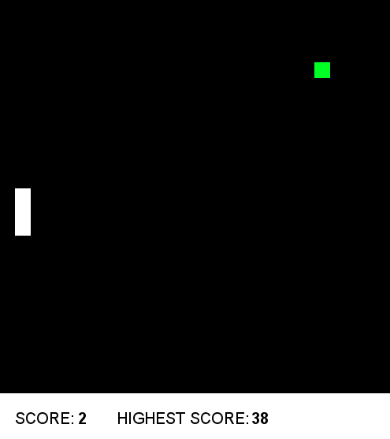

<div align="center">
  <h1>Snake Machine Learning</h1>
  <strong>Reinforcement Learning for the classic snake game</strong>
  
</div>

### Installation

1. Clone the repository: `git clone [repo-url]`
2. Install all dependencies: `pipenv install --dev`

### Run

```python
pipenv run python -m snake_machine_learning 
```