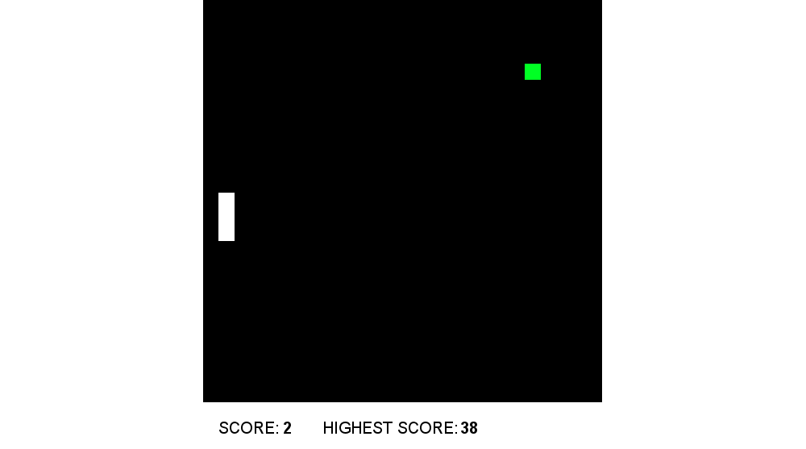

<div align="center">
  <h1>Snake Machine Learning</h1>
  
</div>

### Introduction 

In this project, Deep Reinforcement Learning is used to learn to play the classic Snake game.  11 input states are used to train Deep Q-Learning algorithm and positive or negative rewards are given depending on the AI's actions. 

### Installation

1. Clone the repository: `git clone [repo-url]`
2. Install all dependencies: `pipenv install --dev`

### Run

```python
pipenv run python -m snake_machine_learning 
```